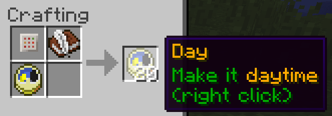

# Command Item

## About

This mod adds a customizable consumable item.

## Motivation

The vanilla command block allows map makers a lot of flexibility by triggering arbitrary commands in response to redstone signals. However in some cases it
would be more natural to give the player a usable item to execute the command. Some possible use cases are:
* A teleport scroll.
* An instant buff item.
* A customized mob spawning egg.

I hoped such an item could be added to vanilla. Indeed this has been [suggested before](http://www.reddit.com/r/minecraftsuggestions/comments/16oczq/consumable_command_item/),
and also [requested as a mod](http://www.minecraftforum.net/forums/mapping-and-modding/minecraft-mods/requests-ideas-for-mods/2381398-command-item-mod-request).

This mod can act as a proof of concept to support a suggested addition to vanilla. It also should support basic functionality when running on a server with vanilla clients
connected.

## Details

The mod adds two items:
* command\_item:command\_slate
* command\_item:command\_rune

Like the vanilla command block, they can only be obtained via /give. The command rune can be configured to take the appearance of any item, and execute commands when right clicked.

To craft a command rune, first /give a command slate:
```
/give @p command_item:command_slate
```
Craft the command slate with a book (writable or written). The book should contain the desired list of commands on the first page,
one per line. The second page can specify the following options (again one per line):

Option|Effect
----|----
keep|Command rune is not consumed when used. Note that creative mode players retain runes regardless of this option.
duration=n|Player must hold right click for n ticks to use the rune.
stacksize=n|Identical command runes stack up to n per slot (default 64).

Finally the third and fourth pages can contain a customized name and description. A third crafting ingredient can be added to
customize the appearance.




It is also possible to produce a command rune by specifying the NBT tag directly with /give. Examples:
```
/give @p command_item:command_rune 1 0 {cmd:{cmd:["tp @p ~ ~3 ~","tell @p Up!"]}}
/give @p command_item:command_rune 1 0 {cmd:{cmd:["time set 1000"],keep:1,duration:20},mimicItem:{id:"minecraft:clock"}}
/give @p command_item:command_rune 1 0 {cmd:{cmd:["particle heart ~ ~2 ~ .4 .4 .4 1 3"],keep:1,Name:"{text:Love,color:red,bold:true}"}}
/give @p command_item:command_rune 9 0 {cmd:{cmd:["give @p minecraft:diamond_sword"],stacksize:9},mimicItem:{id:"minecraft:diamond"}}
```


## Credits
Many resources were useful when writing this mod; some of them are
* Minecraft and Forge source code
* [Tutorials by _Bedrock_Miner_](bedrockminer.jimdo.com/modding-tutorials/)
* [Packet tutorial by coolAlias](http://www.minecraftforum.net/forums/mapping-and-modding/mapping-and-modding-tutorials/2137055-1-7-x-1-8-customizing-packet-handling-with)
* [Packet tutorial by diesieben07](http://www.minecraftforge.net/forum/index.php/topic,20135.0.html)

## Future improvements

This section is essentially notes for myself...
* Unit tests (especially GuiTextBox, CommandSlate, CommandRune, BookReader). Need to mock all the globals
* Add interrupt option (on damage taken)
* Try vanilla client ([ideas](http://www.minecraftforge.net/forum/index.php/topic,31765.html))
	* Option 1: Intercept packets to client and translate mod items to vanilla items (with custom NBT)
	* Option 2: Add "vanilla mode" mod configuration option, use vanilla items with NBT on client and server