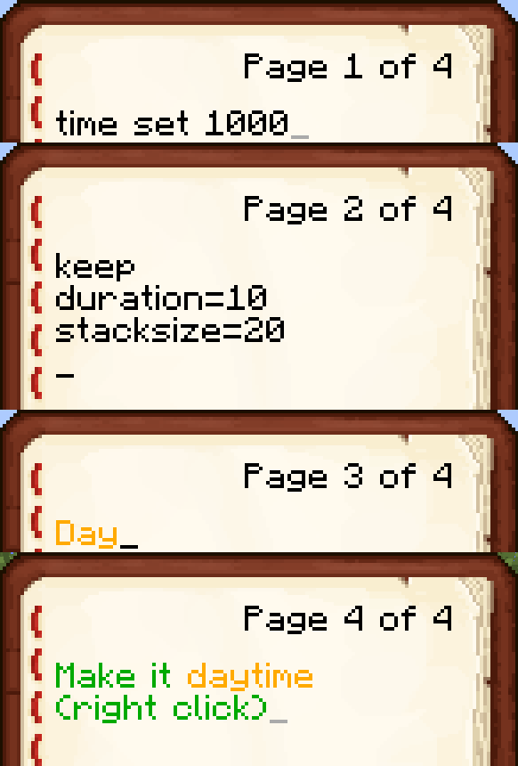

# Command Item

## About

This mod adds transportable, single use command blocks.

## Motivation

The vanilla command block allows map makers a lot of flexibility by triggering arbitrary commands in response to redstone signals. However in some cases it
would be more natural to give the player a usable item to execute the command. Some possible uses:
* A teleport scroll.
* An instant buff item.
* A customized mob spawning egg.

I hoped such an item could be added to vanilla. Indeed this has been [suggested before](http://www.reddit.com/r/minecraftsuggestions/comments/16oczq/consumable_command_item/),
and also [requested as a mod](http://www.minecraftforum.net/forums/mapping-and-modding/minecraft-mods/requests-ideas-for-mods/2381398-command-item-mod-request).

This mod can act as a proof of concept to support a suggested addition to vanilla. It also should support basic functionality when running on a server with vanilla clients
connected (doesn't work yet).

## Command slate

A blank command slate can be configured with commands and options, and used to produce command runes. 
```
/give @p command_item:command_slate
```
Right click the slate to open a GUI. Enter the commands, title and description.


Customize options such as whether the item is consumed on use. Note: In creative mode the rune is never consumed.

Shift-click an item to set the appearance of the rune.

Finally take runes from the output slot.

Right click to use the rune.


## Creating runes with NBT tags

Instead of using the GUI, you can also use /give to make runes. Examples:
```
/give @p command_item:command_rune 1 0 {cmd:{cmd:["tp @p ~ ~3 ~","tell @p Up!"]}}
/give @p command_item:command_rune 1 0 {cmd:{cmd:["time set 1000"],keep:1,duration:20},mimicItem:{id:"minecraft:clock"}}
/give @p command_item:command_rune 1 0 {cmd:{cmd:["particle heart ~ ~2 ~ .4 .4 .4 1 3"],keep:1,Name:"{text:Love,color:red,bold:true}"}}
/give @p command_item:command_rune 9 0 {cmd:{cmd:["give @p minecraft:diamond_sword"],stacksize:9},mimicItem:{id:"minecraft:diamond"}}
```

## Crafting recipes

A configured command slate can be crafted directly into a rune.


A blank slate can be crafted with a book (containing commands, description and options) and another item (to determine the appearance).



## Credits
Many resources were useful when writing this mod; some of them are
* Minecraft and Forge source code
* [Tutorials by _Bedrock_Miner_](bedrockminer.jimdo.com/modding-tutorials/)
* [Packet tutorial by coolAlias](http://www.minecraftforum.net/forums/mapping-and-modding/mapping-and-modding-tutorials/2137055-1-7-x-1-8-customizing-packet-handling-with)
* [Packet tutorial by diesieben07](http://www.minecraftforge.net/forum/index.php/topic,20135.0.html)

## Future improvements

This section is essentially notes for myself...
* Add interrupt option (on damage taken)
* Allow vanilla client ([ideas](http://www.minecraftforge.net/forum/index.php/topic,31765.html))
	* Option 1: Intercept packets to client and translate mod items to vanilla items (with custom NBT)
	* Option 2: Add "vanilla mode" mod configuration option, use vanilla items with NBT on client and server
Try to reduce the globals (eg commandRune, commandItem, move packet into proxy)
